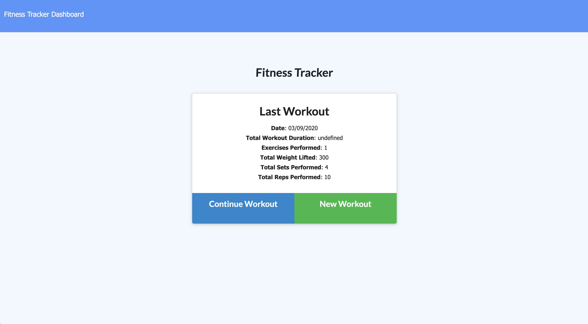
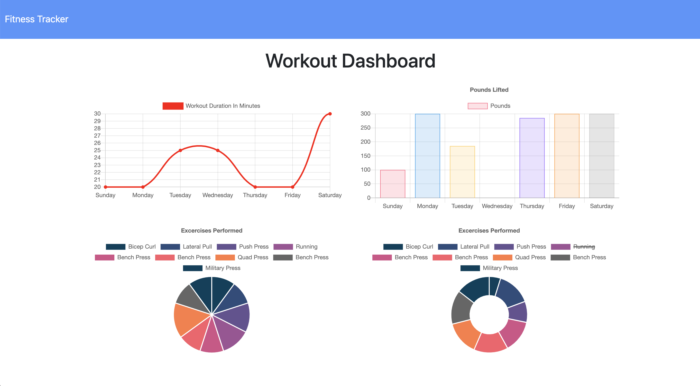

# Workout-Tracker
[](https://opensource.org/licenses/MIT)

## Table of Contents
- [Description](#description)
- [Installation](#installation)
- [Usage](#usage)
- [License](#license)
- [Contributing](#contributing)

## Description
A workout tracker to log exercises you complete! You can then view your statistics on a dashbaord. This app uses Express, MongoDB, Mongoose, deployed on Heroku.

## Installation
Clone or download the package and open terminal in the package directory. Then run the following command to install all the dependencies into the local node_modules folder:

```
npm i
```

## Usage
Deployed application link TBA..

The application landing page will look something like this:


And the workout dashboard something like this:



## License
Licensed under the MIT License.

## Contributing
To contribute directly to the code base, please see this [How to Contribute](https://github.com/Microsoft/vscode/wiki/How-to-Contribute) document.
